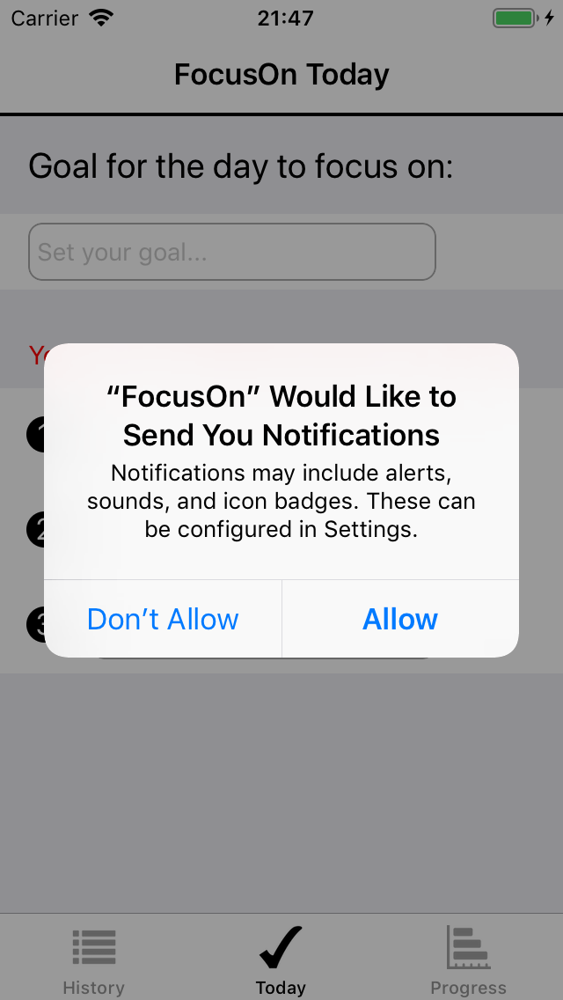
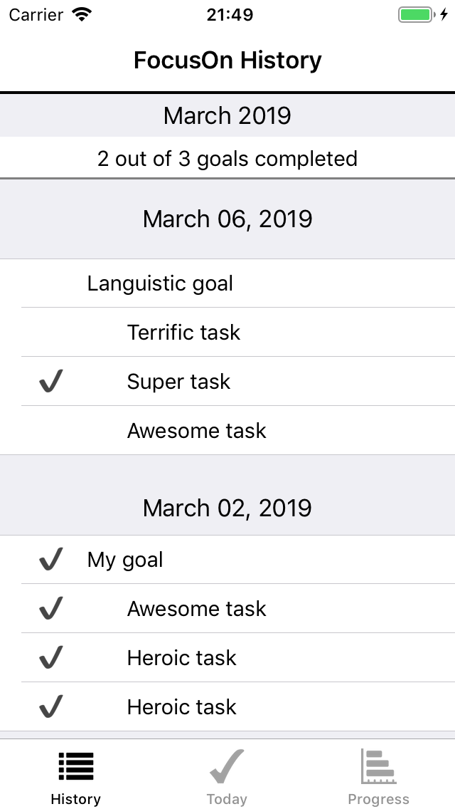
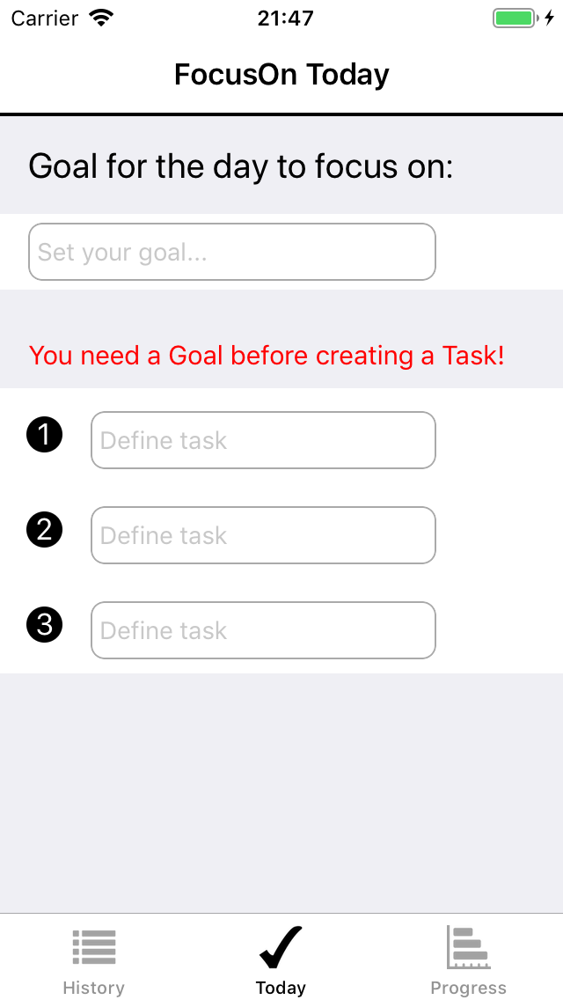
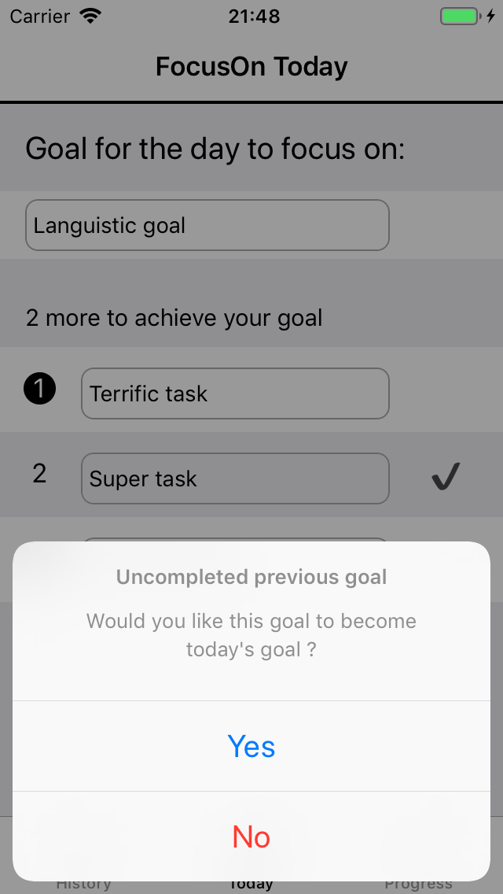
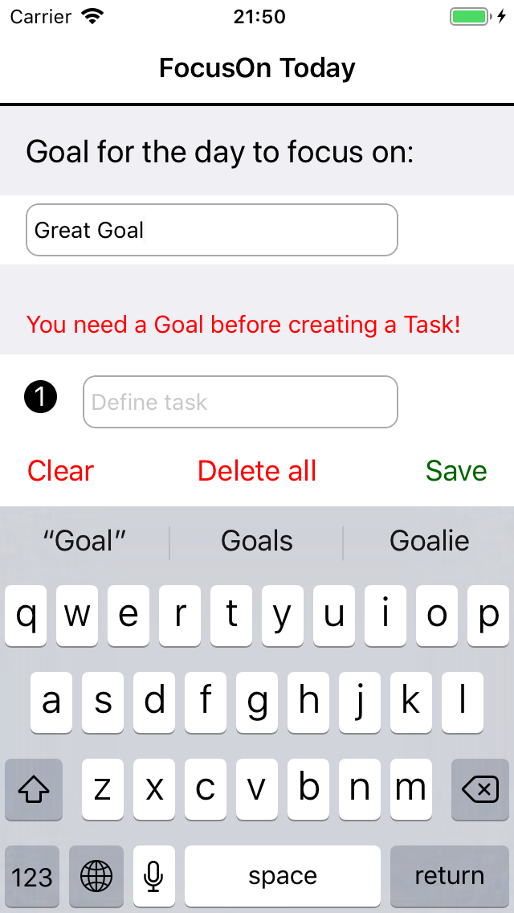
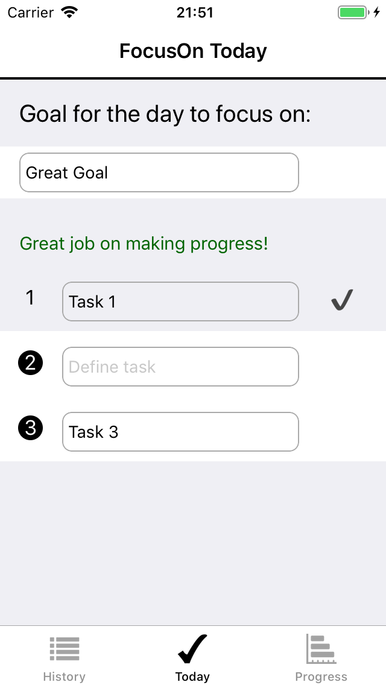
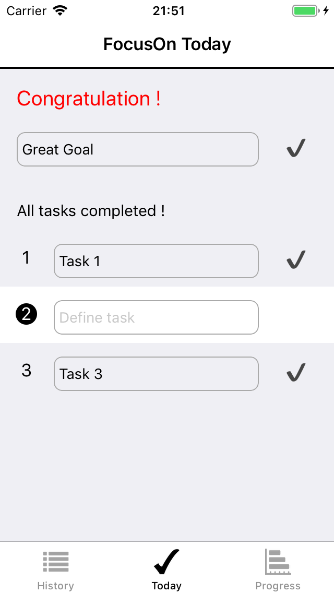
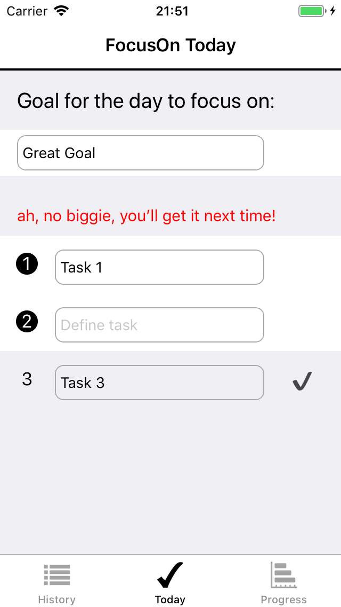
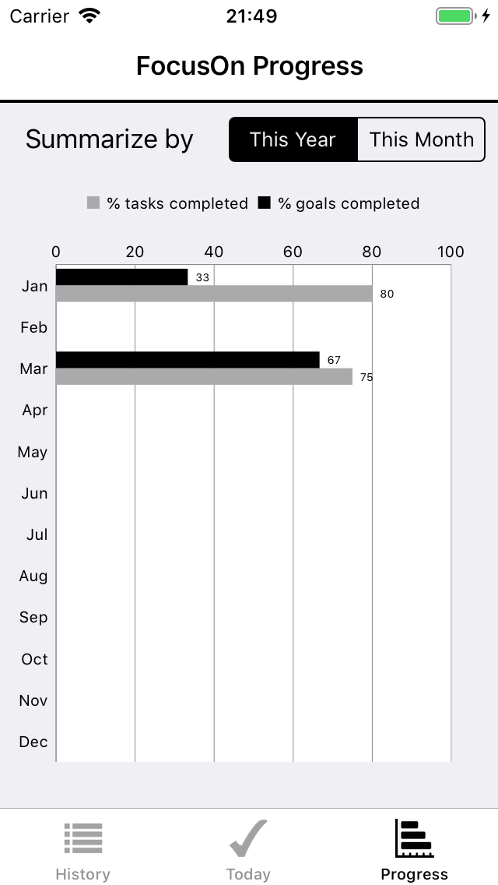
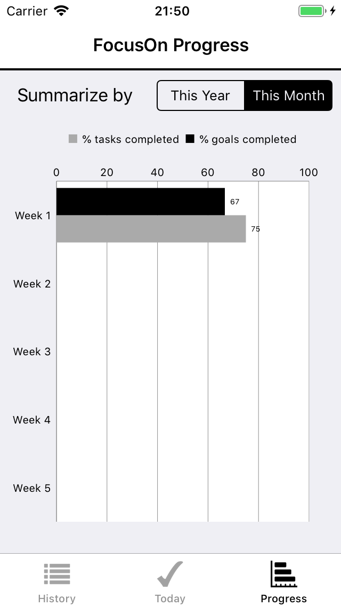

## FocusOn - iPhones, portrait - Core Data - Charts library

This is a todo list application. 
This application has three tabs:
1. History
2. Today
3. Progress

## Contact:
If you have any questions contact me at <a href="mailto:spencer.forrest.ios@gmail.com">spencer.forrest.ios@gmail.com</a>

## Charts library:
This is the link of the library used to produce the charts on this app:
<a href="https://github.com/danielgindi/Charts">Charts library</a>

## Notification:
The application will send a notification 4 hours after the user's last visit to remind him/her to check his/her goal.

 

## History:
List the goals per day with their corresponding tasks.
The user can see whether the goals/tasks are completed.

## Today:
The user can add/remove/update one goal and its corresponding three tasks for the day.
The user needs to have first a goal for the day before adding any task.

 

If the user does not have a goal for the day and if he has an uncompleted goal from a previous day, 
the application will propose him/her to make it the new goal for the day.

 

The keyboard has an input accesory view that allows the user to delete the goals and its tasks for the day.

 

When the user checks a task, a congratulation message will appear in green.

 

When the user checks all tasks, the goal will be automatically checked. 
If the user checks the goal then all its tasks will be automatically checked.

 

When the user unchecks a task, the goal will be automatically unchecked; moreover, an encouragement message will appear.

 

## Progress:
The application shows a chart indicating the percentage of goals and tasks completed for each months of the current year.

 

The application can also show a chart indicating the percentage of goals and tasks completed for each week of the current month.

 
